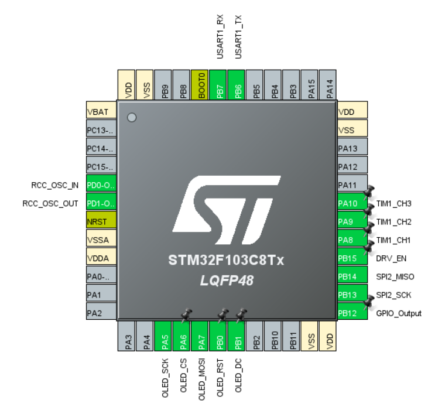

# miniFOC

This repository records my development of miniFOC. I have an immature design and those ideas haven't been verified.

So _**DON'T USE ANY MATERIALS DIRECTLY!**_ I won't response for any mistakes.

Except for this, `Software/foc/foc.ioc` is only used for configuration reference.

    
     
    <u>miniFOC design(concept), HangX-Ma</u>

    
     
    <u>Current STM32CubeMX settings, HangX-Ma</u>

> I will try to use sensor-less control strategy if the fundamental functions all perform well.

## Environment

- **Serial Port Tool:** [Vofa+](https://www.vofa.plus/downloads/?v=7/17/2023)
- **OLED UI:** [WouoUI](https://github.com/RQNG/WouoUI), [uYanki/menu](https://github.com/uYanki/board-stm32f103rc-berial/tree/main/7.Example/hal/gui/u8g2/02_menu), [小蛋显璐](https://www.bilibili.com/video/BV1RY411f7GT/?share_source=copy_web&vd_source=1056f83cab1f5ee1d05548018d3e8731)
- **Dev Tools:** VSCode, CMake, OpenOCD, STLInk-v2, STM32CubeMX
- **Debugger:** Cortex-Debug
- **Library:** [u8g2](https://github.com/olikraus/u8g2), [Qfplib-M3](https://www.quinapalus.com/qfplib-m3.html)

## Problem Found

- SPI output pins sequence needs to be `CS`, `SCLK`, `MISO`, `MOSI`.
- Magnetic attached to motor will affect the motor itself, my friend suggests me to use sensorless control strategy.
- More power ports need to be reserved, such as `GND`, `3V3`.
- SPI OLED ports sequence needs to be `GND`, `VCC`, `SCK`, `MOSI`, `RST`, `DC`, `CS`.

## Development Logs

- Add current sense monitor feedback, thus, creating a current control loop.
    > :x: Current phase sequence is necessary to be identified. I haven't solve the it. Motor can not work when current feedback added.
- Add _Torque Control_ part, reconstruct the control logic and delete some abundant codes.

### 2023-07-29

- Add velocity control loop and fix the jitter problem.
- Add position control loop.
- Add motion switch function and fix the motor jump problem when control type switches.
- Remove integral part in _Angle Control_. Only proportional part is left.
    > :heavy_exclamation_mark: Integral part actually causes serious overshoot problem and affects the system response speed.

### 2023-07-28

- Attach the magnetic with shaft sleeve, sticking it on the shaft.
- Remake an encoder board because previous one seems to be damaged.
- Ensure the UVW sequence of the Motor.
- [Pass TEST3]: Open loop position control test passes.
- Add `printf` redirection code.
- Add sensor alignment code: Identify the sensor direction, pole pairs and calculate the zero electrical angle offset.
    > The code will be trapped into a rabbit hole if the motor rotates not fluently. So check the serial output first!

### 2023-07-26

- Add OLED menu base code.

### 2023-07-25

- INA199x1 has been configured successfully. I use TIM3 to generate update event to trigger ADC1 to start multi-channel conversion. The conversion result will be carried by DMA and send to specific address.
- Add `get_RS_current` function that can conveniently return the rotor and stator current (Id and Iq). I also write a test code for it.

### 2023-07-24

- SC60228DC magnetic encoder works well. I brought _5 mm x 2 mm (d x h)_ magnetic but can not stick it to the motor bearing using hot-melt adhesive. I will use AB glue instead.
    > Waiting for essential materials again~

### 2023-07-23

- Add SVPWM control module and change PWM to center aligned mode.
- [Pass TEST2]: SVPWM control test passes.

### 2023-07-22

- [Pass TEST1]: Direct given PWM can successfully drive BLDC motor.
- Fix transmission error of SPI2, which is linked to magnetic encoder. But I forget to buy the magnetic, so fully check hasn't been done.

### 2023-07-21

- Add [u8g2](https://github.com/olikraus/u8g2) OLED library and add OLED demo code.
    >
    > - :x: OLED can not display normally, which needs further checking.
    > - :heavy_check_mark: Remove SPI1 DMA and the SPI OLED can display normally using u8g2.

- Reconstruct PWMx configurations and merges it into BLDC configurations.
- Add BLDC motor tests for checking different BLDC motor working conditions.
- Add USART control to start or stop BLDC motor.
- Driver board has been prepared.

### 2023-07-19

- Add [Qfplib-M3](https://www.quinapalus.com/qfplib-m3.html) float-point library and it works well!
    > I use cortex-debug plugin and it shows that Qfplib-M3 is visibly faster than software float-point calculation.
- Add Vofa+ communication protocol and configure USART1.
    >
    > - :question: Cough... It seems that my CH340 serial communication device breaks down. Need further checking.
    > - :heavy_check_mark: I use logic analyzer to capture output of _**PB6(Tx)**_ and it actually gives me different waveforms, which means that the CH340 is actually broken.

### 2023-07-18

- Change SPI mode to **(Receive Only Master)** and finish the SC60228DC software logic.
    > Use OOP concept to write SC60228DC, use method in `g_encoder` can satisfy the user's need.

### 2023-07-17

- :book: Create a mind map about _miniFOC_ design.
- :rocket: Finish the board design but haven't check the details. Prepare for further checking and BOM selections.
    > :heavy_check_mark: BOM and board have been checked. Waiting for all materials to arrive.
- Remove `TIM1_CH1N`, `TIM1_CH2N`, `TIM1_CH3N` settings， because they are not used in this driver.

### 2023-07-15

- :x: I tried to use proteus 8.15 to develop the software using online simulation, but the NMOS in proteus performed abnormally. I will use **Logic Analyzer** instead and design the modular board.

## License

Apache License Version 2
