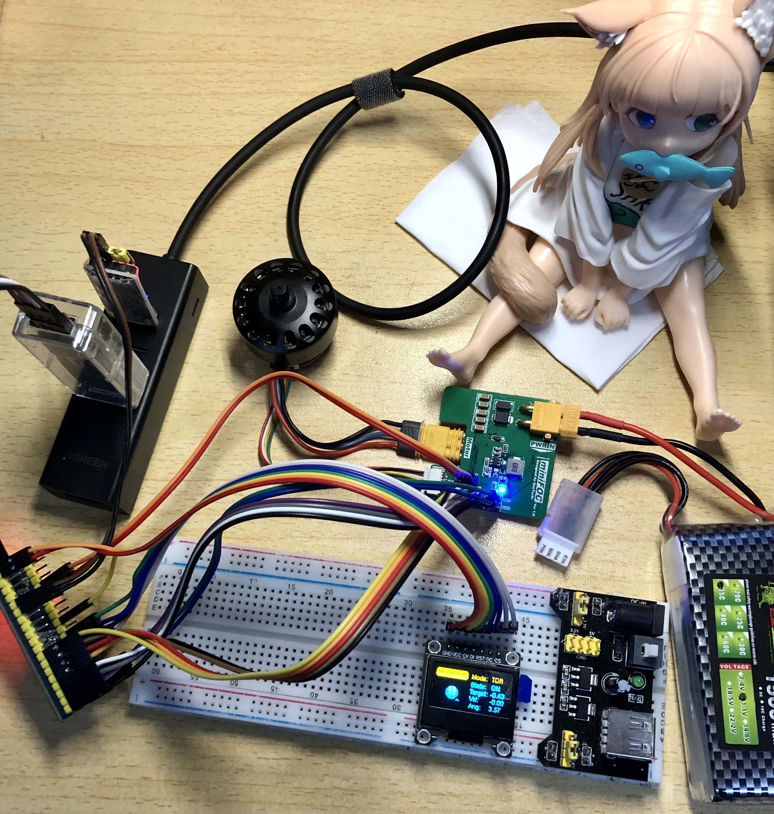

# miniFOC

This repository records my development of miniFOC. You can obtain the source files of the hardware and software in this repository.

## Introduction

This FOC driver board has three control mode, _Torque_, _Velocity_, _Angle_. You can control the motor accurately and smoothly using _**Voltage Control**_, because I haven't solved the _**Current Loop Control**_ problem.

Vofa+ can be used to control the motor conveniently. I also design a group of virtual keys to test the menu UI. You can find Vofa+ command configuration [vofa+.cmds.json](/Software/foc/vofa+.cmds.json) and [foc_debugger.tab.json](/Software/foc/foc_debugger.tab.json) that can assist you build up your debug platform quickly.

I have added a `Torque Ratchet Mode` under torque control. You can have a try.

> **NOTE:** `Software/foc/foc.ioc` is only used for configuration reference.
>
> **NOTE:** :heavy_exclamation_mark: The hardware design is immature, which has some line sequence mistakes.

You can check the pin set via [cubemx-settings](assets/cubemx-settings.png). Vofa+ debugger tab can also be found in [assets/vofaplus.png](assets/vofaplus.png).

    
     
    <u>miniFOC design(concept), HangX-Ma</u>
     
     

    
     
    <u>FOC board and other components, HangX-Ma</u>
     
     

> I will try to use sensor-less control strategy if the fundamental functions all perform well.

## Driver Parameters

- **Input voltage range:** 8 V ~ 40 V (Drv8313, ME3116)
- **Voltage supply:** 12V
- **Maximum current:** 2 A (Drv8313)
- **Serial port baud rate:** 115200
- **MCU:** STM32F103C8T6, 64 KB flash, 20 KB RAM
- **OLED:** SSD1306, 128 x 64, 7 wires SPI

## Environment

- **Serial Port Tool:** [Vofa+](https://www.vofa.plus/downloads/?v=7/17/2023)
- **OLED UI:** [WouoUI](https://github.com/RQNG/WouoUI), [uYanki/menu](https://github.com/uYanki/board-stm32f103rc-berial/tree/main/7.Example/hal/gui/u8g2/02_menu)
- **Dev Tools:** VSCode, CMake, OpenOCD, STLInk-v2, CMSIS-DAPv2, STM32CubeMX
- **Debugger:** Cortex-Debug
- **Library:** [u8g2](https://github.com/olikraus/u8g2), [Qfplib-M3](https://www.quinapalus.com/qfplib-m3.html)

## Features

- [x] Using space vector pulse width modulation
- [x] Torque control without current sensor
- [x] Rotational speed closed loop control
- [x] Rotation angle closed loop control
- [ ] Torque control with current sensor
- [x] Smooth UI that can be controlled by virtual keys currently via Vofa

## FOC Application

- Torque Ratchet Mode: Under torque control, the motor will act like a ratchet.
- TODO

## Problem Found

- SPI output pins sequence needs to be `CS`, `SCLK`, `MISO`, `MOSI`.
- Magnetic attached to motor will affect the motor itself, my friend suggests me to use sensorless control strategy.
- More power ports need to be reserved, such as `GND`, `3V3`.
- SPI OLED ports sequence needs to be `GND`, `VCC`, `SCK`, `MOSI`, `RST`, `DC`, `CS`.
- `nFault` pin of the DRV8313 needs to be controlled and monitored by the MCU. Currently, only unplugging battery can release the DRV8313 off the fault state.

## Development Logs

### 2023-08-01 to 2023-08-04

- Add OLED smooth menu UI and make control relationship between UI and motor. The motor information such that **Motor Control Mode**, **Motor State**, **Control Target**, **Shaft Velocity**, **Shaft Angle**. The animation in _MainUI_ will show you the state of motor!

### 2023-07-31

- Find a project procedure problem that you must reconfirm the encoder direction if you reassemble your hardware.
- Only low speed mode can support the motor position rebound test. Otherwise, the motor will be damaged.
    > :sob: My motor seems to be damaged. (Update: It recovered!)
- Replace the PWMA current sensor and the current loop start to work.
    > I finally only give Q and D with Kp = 0.6 and make the current loop work. But actually current loop version performs not as good as non current loop version.
- Torque needs to be greater than 0.6 under current loop control.
- Add ratchet mode under torque control.

### 2023-07-30

- Add current sense monitor feedback, thus, creating a current control loop.
    > :x: Current phase sequence is necessary to be identified. I haven't solve the it. Motor can not work when current feedback added.
- Add _Torque Control_ part, reconstruct the control logic and delete some abundant codes.

### 2023-07-29

- Add velocity control loop and fix the jitter problem.
- Add position control loop.
- Add motion switch function and fix the motor jump problem when control type switches.
- Remove integral part in _Angle Control_. Only proportional part is left.
    > :heavy_exclamation_mark: Integral part actually causes serious overshoot problem and affects the system response speed.

### 2023-07-28

- Attach the magnetic with shaft sleeve, sticking it on the shaft.
- Remake an encoder board because previous one seems to be damaged.
- Ensure the UVW sequence of the Motor.
- [Pass TEST3]: Open loop position control test passes.
- Add `printf` redirection code.
- Add sensor alignment code: Identify the sensor direction, pole pairs and calculate the zero electrical angle offset.
    > The code will be trapped into a rabbit hole if the motor rotates not fluently. So check the serial output first!

### 2023-07-26

- Add OLED menu base code.

### 2023-07-25

- INA199x1 has been configured successfully. I use TIM3 to generate update event to trigger ADC1 to start multi-channel conversion. The conversion result will be carried by DMA and send to specific address.
- Add `get_RS_current` function that can conveniently return the rotor and stator current (Id and Iq). I also write a test code for it.

### 2023-07-24

- SC60228DC magnetic encoder works well. I brought _5 mm x 2 mm (d x h)_ magnetic but can not stick it to the motor bearing using hot-melt adhesive. I will use AB glue instead.
    > Waiting for essential materials again~

### 2023-07-23

- Add SVPWM control module and change PWM to center aligned mode.
- [Pass TEST2]: SVPWM control test passes.

### 2023-07-22

- [Pass TEST1]: Direct given PWM can successfully drive BLDC motor.
- Fix transmission error of SPI2, which is linked to magnetic encoder. But I forget to buy the magnetic, so fully check hasn't been done.

### 2023-07-21

- Add [u8g2](https://github.com/olikraus/u8g2) OLED library and add OLED demo code.
    >
    > - :x: OLED can not display normally, which needs further checking.
    > - :heavy_check_mark: Remove SPI1 DMA and the SPI OLED can display normally using u8g2.

- Reconstruct PWMx configurations and merges it into BLDC configurations.
- Add BLDC motor tests for checking different BLDC motor working conditions.
- Add USART control to start or stop BLDC motor.
- Driver board has been prepared.

### 2023-07-19

- Add [Qfplib-M3](https://www.quinapalus.com/qfplib-m3.html) float-point library and it works well!
    > I use cortex-debug plugin and it shows that Qfplib-M3 is visibly faster than software float-point calculation.
- Add Vofa+ communication protocol and configure USART1.
    >
    > - :question: Cough... It seems that my CH340 serial communication device breaks down. Need further checking.
    > - :heavy_check_mark: I use logic analyzer to capture output of _**PB6(Tx)**_ and it actually gives me different waveforms, which means that the CH340 is actually broken.

### 2023-07-18

- Change SPI mode to **(Receive Only Master)** and finish the SC60228DC software logic.
    > Use OOP concept to write SC60228DC, use method in `g_encoder` can satisfy the user's need.

### 2023-07-17

- :book: Create a mind map about _miniFOC_ design.
- :rocket: Finish the board design but haven't check the details. Prepare for further checking and BOM selections.
    > :heavy_check_mark: BOM and board have been checked. Waiting for all materials to arrive.
- Remove `TIM1_CH1N`, `TIM1_CH2N`, `TIM1_CH3N` settings， because they are not used in this driver.

### 2023-07-15

- :x: I tried to use proteus 8.15 to develop the software using online simulation, but the NMOS in proteus performed abnormally. I will use **Logic Analyzer** instead and design the modular board.

## License

Apache License Version 2
