# miniFOC

This repository records my development of miniFOC. I have an immature design and those ideas haven't been verified.

So _**DON'T USE ANY MATERIALS DIRECTLY!**_ I won't response for any mistakes.

    
     
    <u>miniFOC design(concept), HangX-Ma</u>

## Development Logs

### 2023-07-17

- :rocket: Finish the board design but haven't check the details. Prepare for further checking and BOM selections.
- :book: Create a mind map about _miniFOC_ design.

### 2023-07-15

- :x: I tried to use proteus 8.15 to develop the software using online simulation, but the NMOS in proteus performed abnormally. I will use **Logic Analyzer** instead and design the modular board.

## License

Apache License Version 2
