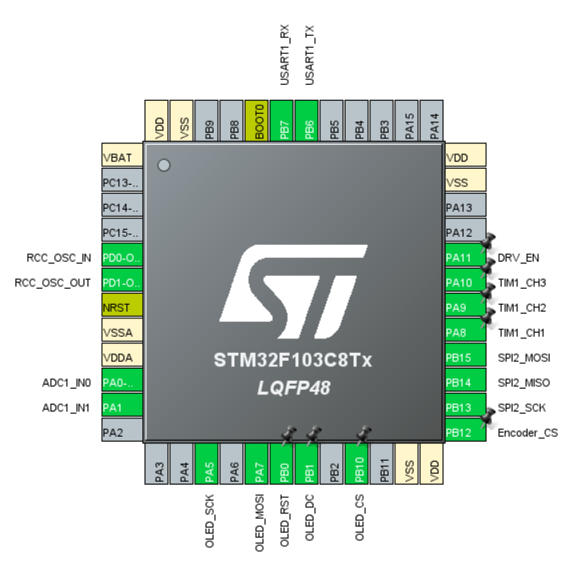

# miniFOC

This repository records my development of miniFOC. I have an immature design and those ideas haven't been verified.

So _**DON'T USE ANY MATERIALS DIRECTLY!**_ I won't response for any mistakes.

    
     
    <u>miniFOC design(concept), HangX-Ma</u>

    
     
    <u>Current STM32CubeMX settings, HangX-Ma</u>

## TODO

- [ ] Add Basic _SVPWM_ control algorithm.
- [ ] Use SPI protocol to communicate with _**SC60228DC**_ encoder.
    > :question: _**(Logic finished, not checked)**_
- [ ] Design OLED display library. Prepare to take a reference to [WouoUI](https://github.com/RQNG/WouoUI).
- [ ] Use UART to debug and control motor. [[Vofa+]](https://www.vofa.plus/downloads/?v=7/17/2023)

## Development Logs

### 2023-07-18

- Change SPI mode to **(Receive Only Master)** and finish the SC60228DC software logic.
    > Use OOP concept to write SC60228DC, use method in `g_encoder` can satisfy the user's need.

### 2023-07-17

- :book: Create a mind map about _miniFOC_ design.
- :rocket: Finish the board design but haven't check the details. Prepare for further checking and BOM selections.
    > :heavy_check_mark: BOM and board have been checked. Waiting for all materials to arrive.
- Remove `TIM1_CH1N`, `TIM1_CH2N`, `TIM1_CH3N` settings， because they are not used in this driver.

### 2023-07-15

- :x: I tried to use proteus 8.15 to develop the software using online simulation, but the NMOS in proteus performed abnormally. I will use **Logic Analyzer** instead and design the modular board.

## License

Apache License Version 2
